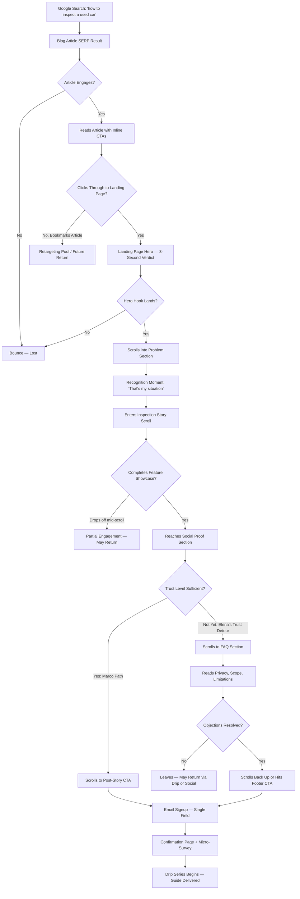
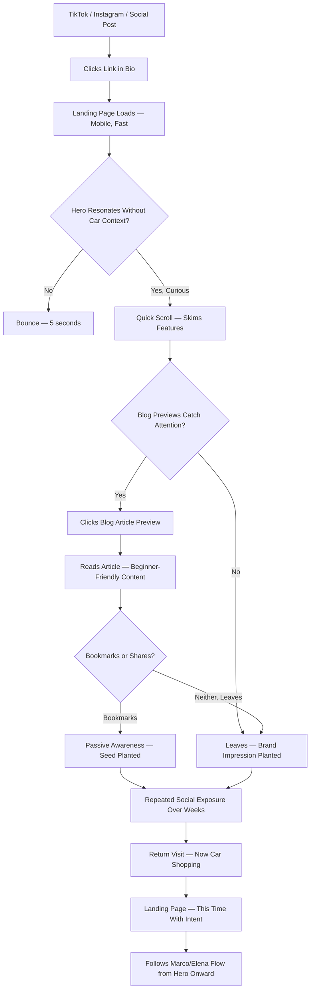
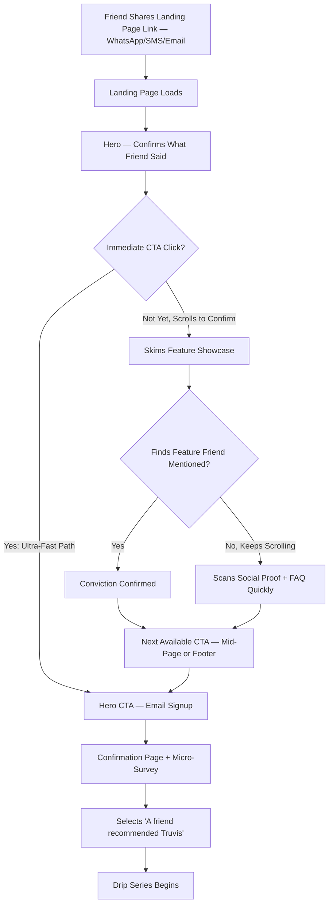
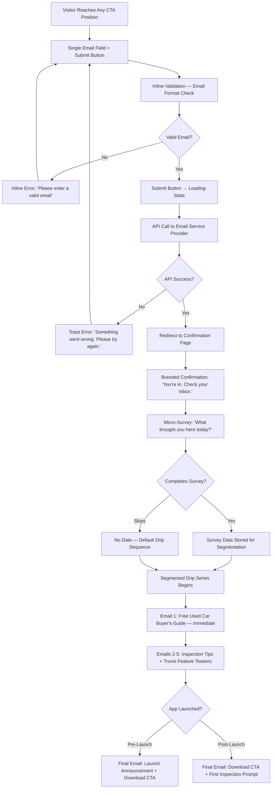
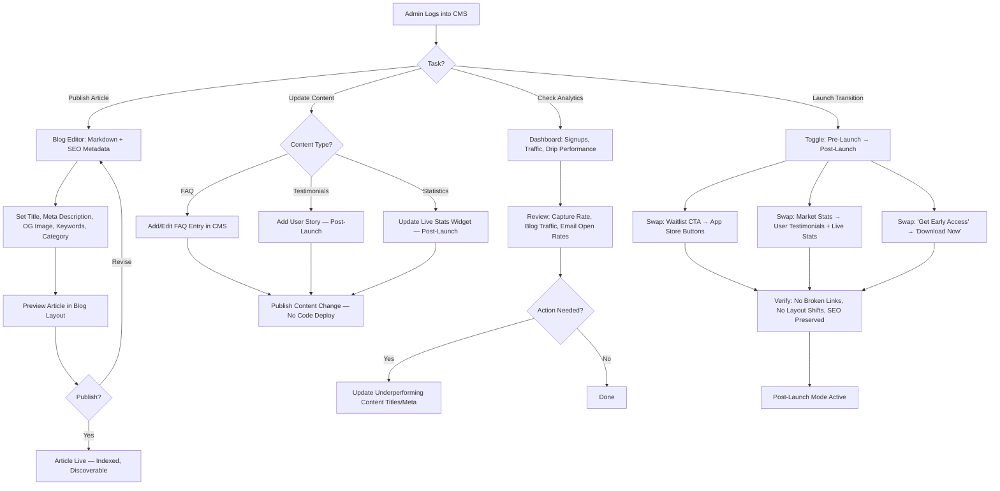

# UX Design Specification Truvis Landing Page

**Author:** Cristian
**Date:** 2026-04-08

---

<!-- UX design content will be appended sequentially through collaborative workflow steps -->

## Executive Summary

### Project Vision

The Truvis landing page is a conversion-optimized static website that serves as the primary acquisition channel for Truvis — a mobile app that guides used-car buyers through vehicle inspections with severity scoring, model-specific intelligence, and behavioral guardrails. This is a greenfield web project (SSG + CDN + headless CMS), independent of the Expo mobile app codebase.

The page operates in two phases. Pre-launch, it captures a waitlist of high-intent buyers through SEO-optimized blog content, a financial-hook hero section, and an email drip series that delivers immediate value (free Used Car Buyer's Guide). Post-launch, it becomes the download funnel — swapping waitlist CTAs for app store buttons, layering in real user stories, live inspection statistics, and app store ratings. The transition is a content toggle, not a rebuild.

The core acquisition insight: buyers are already searching for help. "How to inspect a used car" is a high-intent query where no consumer app owns the conversation. The landing page captures that demand, builds trust through free value, and converts visitors into users before they encounter an alternative. The brand voice — 70% Inspector, 30% Ally — starts on the landing page, not in the app. By the time a visitor installs, they already know what Truvis sounds like.

### Target Users

**Marco — The Anxious First-Time Buyer (High-Intent Organic)**
Age 25-35. No mechanical knowledge. Googling "what to check when buying a used car" at 11pm. Arrives via blog article, reads with genuine interest, clicks through to landing page. The financial hook (€640 average loss) makes it personal. The feature showcase gives him things he didn't know existed. The drip series teaches him what he needs, and by launch day he's been waiting for the app. UX priority: linear narrative that builds from problem → solution → action, with clear blog-to-landing-page-to-signup flow.

**Elena — The Skeptical Burned Buyer (Trust-First)**
Age 30-45. Bought a bad car before. Arms crossed, scanning quickly. She won't read every word — she'll look for proof that someone understands her situation. Poker Face Mode hooks her. The FAQ section earns her trust through transparency (privacy, scope, limitations). She may not convert on first visit. UX priority: scannable layout, trust signals near CTAs, transparent FAQ, features that resonate emotionally (not just functionally).

**Dani — The Social Visitor (Low-Intent, Future Conversion)**
Age 22. Arrives from TikTok at midnight. Not actively shopping. The hero needs to work without car-buying context. Blog content gives them something to bookmark. They'll convert months later after repeated social exposure. UX priority: fast mobile load (<2s on 3G), blog content visible on the landing page itself, memorable brand impression in a single scroll.

**Sofia — The Warm Referral (Pre-Sold, Fast Path)**
Age 34. Friend shared an inspection report link. Already has social proof from someone she trusts. Needs to go from landing → signup in under 2 minutes without being forced through the full scroll. UX priority: fast-path CTA access from multiple page positions, feature showcase that confirms what her friend already told her.

**Content Admin (Cristian)**
Publishes blog articles, manages pre/post-launch toggle, monitors analytics, updates FAQ and testimonials. UX priority: CMS-driven content management with no code deployments for content changes.

### Key Design Challenges

1. **Multi-intent audience on a single page** — The page must serve high-intent searchers (Marco), skeptical returners (Elena), low-intent social visitors (Dani), and pre-sold referrals (Sofia) without boring the warm or overwhelming the cold. The information architecture needs both a compelling linear scroll narrative and fast-path shortcuts to CTAs.

2. **Category creation, not comparison** — No "guided mobile inspection app" category exists in visitors' minds. The page cannot rely on competitive positioning — it must make a new concept immediately understandable. Each feature must translate from abstract capability to concrete "I need that" moment without requiring car knowledge.

3. **Pre-launch credibility with zero social proof** — New domain, no users, no ratings, no testimonials. Trust must be built through content quality, market statistics, transparent positioning, and the value exchange of the free guide — not logos and star ratings. The design must accommodate this gap gracefully while leaving clear slots for real social proof post-launch.

4. **Dual-phase content architecture** — The same page structure must serve waitlist mode and download mode without breaking SEO equity, analytics continuity, or visual coherence. Post-launch content (user stories, live stats, app ratings) must be designed into the layout from day one, even while pre-launch alternatives occupy those slots.

5. **Performance-constrained visual design** — Mobile-first with <2s load on 3G, <500KB initial page weight, LCP <2.5s, CLS <0.1. The design must be visually compelling within these constraints — no heavy hero media, no complex animations that harm performance, no layout shifts from lazy-loaded content.

### Design Opportunities

1. **Blog as trust gateway** — The blog is the primary acquisition channel, not an afterthought. Genuinely helpful articles pre-qualify visitors and build trust before they see a CTA. The UX can make blog-to-landing-page transitions feel like a natural deepening of the relationship rather than a sales redirect.

2. **Brand voice as conversion differentiator** — The 70/30 Inspector/Ally personality is distinctive in a market of corporate SaaS language. If carried consistently through hero copy, feature descriptions, FAQ answers, and email subject lines, the brand voice itself becomes the user experience — the way information is presented is as important as what's presented.

3. **Email drip as progressive trust ladder** — The 4-6 email sequence is a UX flow that happens outside the browser. Each email builds readiness so that by launch day, subscribers feel like returning users, not first-time visitors. The confirmation page micro-survey provides intent data from day one, enabling audience validation before a single line of app code ships.

4. **Scroll-as-inspection-story** — Instead of a static feature card grid, the feature showcase can walk visitors through a simulated inspection journey. Each of the six capabilities becomes a scene in a narrative scroll: arrive at the car (Model DNA) → start checking (Severity Calibrator) → calibrate to your budget (Personal Risk Calibration) → the seller is watching (Poker Face Mode) → something's wrong (Hard Stop Protocol) → ready to negotiate (Negotiation Report). This demonstrates the category through experience rather than explanation — visitors live the inspection before downloading the app.

5. **Micro-story hero framing** — The financial hook (€640 average loss) can be amplified by grounding it in a persona-driven micro-story rather than a bare statistic. "Last month, a buyer paid €7,200 for a car with a €900 problem he couldn't see" makes the number personal and activates the 70/30 Inspector/Ally voice in the first breath.

## Core User Experience

### Defining Experience

The Truvis landing page is a conversion journey through content — not a productivity tool, not a dashboard, not an app screen. The core experience is a visitor arriving with a problem (anxiety about buying a used car), encountering content that demonstrates expertise and earns trust, and leaving with either an email signup (pre-launch) or an app download (post-launch).

The defining interaction is the **shift from "I'm curious" to "I want this."** This transition happens somewhere between the hero and the first CTA. Every design decision — copy, layout, pacing, visual hierarchy — exists to manufacture that shift naturally, without pressure. The page succeeds when the CTA feels like the obvious next step, not a sales ask.

The core user action is **scrolling and reading with increasing trust**. Unlike an app where the core action is a task (tap, swipe, submit), the landing page's core action is comprehension. The visitor must understand what Truvis is, why it matters to them personally, and what they get by signing up — all within a single scroll session that respects their time and intent level.

### Platform Strategy

**Platform:** Responsive web, mobile-first design. Static site generation (SSG) deployed via CDN. No native app, no server-side rendering.

**Primary interaction mode:** Touch on mobile (60%+ expected traffic), mouse/keyboard on desktop. All interactive elements sized for touch (44x44px minimum tap targets) regardless of viewport.

**Device context:**
- Mobile visitors arrive from social media (TikTok, Instagram) and organic search — often browsing casually, one-handed, with short attention spans. The page must communicate value within the first viewport without scrolling.
- Desktop visitors are more likely organic search arrivals or referral clicks — slightly higher intent, willing to read deeper. The page can use horizontal space for side-by-side layouts but must not create a fundamentally different experience.

**Performance as platform constraint:** The SSG + CDN architecture enables aggressive performance targets (<2s load on 3G, <500KB initial weight, LCP <2.5s). These aren't aspirational — they're design constraints. Every visual decision must be validated against these budgets. No hero videos, no unoptimized images, no render-blocking scripts.

**Offline:** Not applicable. The landing page is a web-only experience with no offline requirements.

**Blog integration:** Hybrid model. The landing page surfaces 2-3 blog article previews inline within the scroll flow (visible without navigation), while the full blog index and individual articles live at /blog with their own layout. Blog articles share the same visual language and navigation as the landing page, creating a unified site experience rather than a bolted-on content section.

### Effortless Interactions

**Understanding what Truvis is — zero cognitive effort required.** The scroll-as-inspection-story approach (Design Opportunity #4) makes the product self-explanatory. Visitors don't read a feature list — they experience a simulated inspection journey through the scroll. By the time they reach the CTA, they understand the product because they just lived it, not because they decoded marketing copy.

**Finding the CTA — available whenever the visitor is ready.** CTAs appear at multiple positions (hero, mid-page after feature showcase, footer) so the visitor never has to scroll back to act. For high-intent visitors like Sofia (warm referral), the hero CTA is immediately accessible. For visitors who need the full narrative, the post-story CTA arrives at the natural moment of peak conviction.

**Email signup — frictionless value exchange.** The waitlist form is a single field (email) with a clear value proposition: "Get the free Used Car Buyer's Guide + early access." No name, no phone number, no multi-step form. One tap, one field, one submit. The double opt-in confirmation happens via email, not as an extra form step.

**Blog-to-landing-page flow — seamless, not a redirect.** Visitors arriving from blog articles (Marco's journey) encounter inline CTAs within articles that lead to the landing page. The transition feels like going deeper into the same experience, not being funneled to a sales page. Shared navigation, shared visual language, shared brand voice.

**Pre/post-launch switch — invisible to visitors.** The content toggle between waitlist mode and download mode must produce no visual artifacts, broken links, or layout shifts. A visitor on launch day should experience a polished download page, not a patched-over waitlist page.

### Critical Success Moments

**1. The 3-Second Hero Verdict**
The visitor lands on the page and sees the hero. Within 3 seconds, they decide: scroll or bounce. This is the single highest-leverage moment. The hero must deliver a financial hook grounded in a micro-story ("A buyer paid €7,200 for a car with a €900 problem he couldn't see"), communicate that Truvis is an app that prevents this, and present a CTA — all above the fold, all in one glance. If the hero fails, nothing else on the page matters.

**2. The "That's Me" Recognition**
Somewhere in the problem section or feature showcase, the visitor sees their own situation reflected back at them. Marco sees his anxiety validated. Elena sees Poker Face Mode and thinks "someone gets it." Dani sees a stat that makes them think twice about their future car purchase. This moment of recognition transforms a generic visitor into a personally invested one.

**3. The Feature Showcase Scroll Completion**
The inspection-story scroll (Design Opportunity #4) is the page's core narrative device. If a visitor completes the full feature showcase scroll, they've vicariously experienced the product. Completion of this section is a strong signal of conversion readiness. The CTA immediately following this section is the highest-conversion placement on the page.

**4. The Email Submit**
The moment the visitor types their email and taps submit. The form must feel safe (no unexpected fields, no dark patterns), the value exchange must be explicit (free guide + early access), and the confirmation must be immediate and satisfying (not a blank redirect — a branded confirmation with the micro-survey).

**5. The First Drip Email Open**
Outside the browser but critical to the experience. The first email must deliver on the promise — the free guide arrives immediately, it's genuinely useful, and it reinforces the brand voice. If this email disappoints, the remaining drip series goes unopened and the subscriber is effectively lost.

### Experience Principles

1. **Trust before ask.** Never present a CTA before earning the right to ask. Every section builds credibility — the hero with a concrete financial hook, the problem section with validated pain, the feature showcase with demonstrated capability, the FAQ with transparency. The ask comes after the trust is built, not before.

2. **Show, don't explain.** The landing page demonstrates the product through narrative (scroll-as-inspection-story), not through feature descriptions. Visitors should understand Truvis by experiencing it vicariously, not by reading about it. This applies equally to the blog — articles teach by showing, not by listing.

3. **Respect the intent gradient.** Not every visitor is equally ready to convert. The page architecture serves high-intent visitors (fast-path CTAs, minimal friction) and low-intent visitors (compelling content, blog entry points, memorable brand impression) without forcing either through the other's journey.

4. **One voice, everywhere.** The 70/30 Inspector/Ally brand personality must be consistent across hero copy, feature descriptions, FAQ answers, blog articles, drip emails, and confirmation pages. The voice is the brand. Inconsistency breaks trust.

5. **Performance is experience.** A beautiful page that loads in 4 seconds on mobile is a failed page. Every design decision — images, animations, fonts, scripts — is evaluated against the performance budget first. Speed is not a technical concern; it's a UX decision.

## Desired Emotional Response

### Primary Emotional Goals

**Confidence** — The landing page's primary emotional job is to transform uncertainty into confidence. Every visitor arrives with some form of "I don't know if I can do this" — whether it's inspecting a car (Marco), trusting a new product (Elena), or even knowing if they need help yet (Dani). The page succeeds when the visitor leaves thinking "I can handle this, and this tool will help me."

**Trust** — The second emotional pillar. Trust is harder to earn than confidence because it requires the visitor to believe in Truvis specifically, not just in the idea of guided inspection. Trust is built through transparency (FAQ), demonstrated expertise (blog content, feature showcase), and brand voice consistency (70/30 Inspector/Ally). The page must feel like a knowledgeable friend, not a sales funnel.

**Recognition** — The feeling of being seen and understood. Used-car buying anxiety is rarely validated — friends say "just get a mechanic" and online forums give generic advice. The landing page should be the first place where the visitor's specific situation is reflected back at them with genuine empathy. This is the emotional trigger that converts passive readers into active prospects.

### Emotional Journey Mapping

**Stage 1: Arrival (0-3 seconds)**
- *Arriving emotion:* Uncertainty, curiosity, or skepticism depending on traffic source
- *Target emotion:* Intrigue — "This is different from what I expected"
- *Design lever:* Hero micro-story with financial hook. The visitor sees a concrete, relatable scenario, not a generic tagline. The tone is warm and direct, not corporate.

**Stage 2: Problem Recognition (3-15 seconds)**
- *Arriving emotion:* Intrigue from hero, willingness to scroll
- *Target emotion:* Recognition — "That's exactly my situation"
- *Design lever:* Problem section that validates the visitor's pain with specific, opinionated language. Statistics ground it in reality ("Only 2% of buyers trust dealerships"). The visitor feels understood, not lectured.

**Stage 3: Feature Discovery (15-60 seconds)**
- *Arriving emotion:* Recognition, growing interest
- *Target emotion:* Relief and excitement — "This exists? This is exactly what I need"
- *Design lever:* Scroll-as-inspection-story. Each feature is a scene the visitor experiences vicariously. The emotional arc moves from "I didn't know this was possible" to "I need this." Relief that someone built this. Excitement about what it means for their car purchase.

**Stage 4: Trust Building (60-120 seconds)**
- *Arriving emotion:* Excitement tempered by healthy skepticism
- *Target emotion:* Confidence in Truvis specifically — "These people are legit"
- *Design lever:* Social proof (market statistics pre-launch, real testimonials post-launch), transparent FAQ, blog content previews that demonstrate expertise. The page answers objections before the visitor voices them.

**Stage 5: Conversion (120+ seconds)**
- *Arriving emotion:* Trust, readiness to act
- *Target emotion:* Empowerment — "I'm taking control of this"
- *Design lever:* CTA framed as the visitor's choice, not the page's ask. "Get the free guide + early access" positions signup as the visitor gaining something, not giving something up. The micro-survey on the confirmation page reinforces agency — "We want to help you specifically."

**Stage 6: Post-Conversion (confirmation page + first email)**
- *Arriving emotion:* Commitment, expectation
- *Target emotion:* Satisfaction and anticipation — "That was easy, and I already got value"
- *Design lever:* Immediate delivery of the free guide. Branded confirmation page that feels like a welcome, not a receipt. The first drip email must over-deliver on the promise to cement trust.

### Micro-Emotions

**Confidence vs. Confusion**
Critical at every stage. The page must never make the visitor work to understand what Truvis is. If a visitor pauses to parse a sentence, we've introduced confusion. Copy must be direct. The scroll-as-story structure eliminates the confusion that feature grids create ("which of these six things matters to me?") by presenting them in narrative sequence.

**Trust vs. Skepticism**
The central tension for Elena and a secondary concern for everyone. Skepticism spikes at CTAs — the moment you ask for something (email), the visitor evaluates whether they trust you enough. Trust signals (FAQ transparency, no dark patterns, clear value exchange, GDPR compliance visibility) must be concentrated near CTAs. The FAQ section isn't informational filler — it's a trust-building mechanism for skeptical visitors.

**Recognition vs. Isolation**
The emotional differentiator. Most car-buying resources treat the buyer as a generic consumer. Truvis treats them as a specific person in a specific emotional situation. The problem section and feature showcase must feel like they were written for the visitor personally. The micro-story approach in the hero ("a buyer paid €7,200 for a car with a €900 problem") creates identification, not abstraction.

**Urgency vs. Pressure**
The landing page needs the visitor to act (sign up, not just read). But any hint of manufactured urgency ("Only 47 spots left!") destroys trust instantly. Urgency should come from the visitor's own situation — they're buying a car, the stakes are real, and this tool exists now. The page presents the opportunity; the visitor's own timeline creates the urgency.

### Design Implications

**Confidence → Visual clarity and breathing room.** Generous whitespace, clear visual hierarchy, one message per viewport. No cluttered layouts, no competing CTAs, no information overload. The page should feel calm and authoritative — like a knowledgeable friend's advice, not a billboard.

**Trust → Transparency at friction points.** Every CTA is accompanied by a trust signal: what happens after signup (explicit), what data is collected (minimal), what the visitor gets (specific). The FAQ is positioned strategically, not buried at the bottom. GDPR compliance is visible and plainly worded — privacy is a trust feature, not a legal checkbox.

**Recognition → Persona-resonant copy and scenarios.** The problem section uses language that mirrors how real buyers think and talk — not marketing-speak. Feature descriptions are framed as solutions to specific emotional situations (Poker Face Mode → "the seller won't see your real reaction"), not as technical capabilities.

**Urgency without pressure → Soft persistence, not hard sells.** Multiple CTA placements mean the ask is available whenever the visitor is ready, but never blocking content. No countdown timers, no "limited spots," no pop-up interruptions. The value exchange is always clear and honest. The visitor chooses when to act.

**Relief and excitement → Progressive revelation.** The scroll-as-inspection-story builds emotional momentum. Each scene reveals a new capability that addresses a specific anxiety. The emotional arc peaks at Hard Stop Protocol ("the app will tell you to walk away when you can't tell yourself") and resolves at Negotiation Report ("you leave with leverage, not just feelings"). The CTA after this sequence catches the visitor at peak emotional readiness.

### Emotional Design Principles

1. **Earn every emotion.** Don't manufacture feelings with design tricks — earn them with genuine value. Confidence comes from clear information, not bold fonts. Trust comes from transparency, not trust badges. Recognition comes from accurate empathy, not stock photos of happy people.

2. **Meet the visitor where they are.** Marco arrives anxious — validate his anxiety before offering solutions. Elena arrives skeptical — earn her trust before asking for anything. Dani arrives casual — give them something valuable without demanding commitment. The page doesn't force one emotional journey on all visitors.

3. **The Ally voice defuses the Inspector's authority.** The 70/30 balance isn't just a brand guideline — it's an emotional design tool. Pure authority (100% Inspector) feels cold and creates distance. Pure warmth (100% Ally) feels unsubstantiated. The blend — "here's the hard truth, and here's why you'll be fine" — is the emotional signature that makes Truvis feel like neither a sales pitch nor a lecture.

4. **Negative space is emotional space.** Cramped layouts create anxiety. Visual breathing room communicates confidence — the page doesn't need to shout because it has something real to say. White space isn't empty space; it's where the visitor processes what they just read and decides how they feel about it.

5. **The confirmation is part of the experience.** The emotional journey doesn't end at the submit button. The confirmation page and first drip email are critical emotional touchpoints — they either cement the trust the page built or undermine it. Over-deliver in the first 60 seconds after conversion.

## UX Pattern Analysis & Inspiration

### Inspiring Products Analysis

**New Category Creators:**

**Linear** (linear.app) — Redefined project tracking by showing speed as the category. Dark, minimal aesthetic. Product screenshot as hero, not illustration. Animated product demos replace feature grids. Single CTA with client logos immediately below hero. So influential it spawned its own design trend ("Linear style design").

**Notion** (notion.so) — Initially struggled explaining "what is Notion?" Breakthrough came when they stopped explaining the concept and started showing outputs (templates, finished pages). Sections organized by use case, not feature. Template gallery visible from the landing page. 30M+ users.

**Superhuman** (superhuman.com) — Created desire for a product in a category everyone thought was solved (email). Single hero line: "The fastest email experience ever made." Gated CTA behind an application questionnaire that served triple duty: exclusivity, user prioritization, and intelligence gathering. 60K waitlist signups from one Product Hunt launch. 180K waitlist at peak.

**Pre-Launch Waitlists:**

**Robinhood** (2013 pre-launch) — Ultra-minimal: one headline ("Commission-free trading"), one email field, one phone mockup. 50%+ landing page conversion rate (vs 15% industry average). Queue position + referral mechanic drove 3x viral spread. 1M users before launch with zero paid advertising.

**Arc Browser** (arc.net) — Invitation-only with 1:1 Zoom onboarding for early users. Discord community where waitlisted users interacted with existing users. Word-of-mouth was the entire strategy. Counter-positioned in the most entrenched software category (web browsers) by being radically different, not incrementally better.

**Trust Builders for High-Stakes Decisions:**

**Lemonade Insurance** (lemonade.com) — Disrupted one of the lowest-trust consumer categories. Conversational UI with virtual agent "Maya" — personalizes an impersonal process. Single question per screen. CTA is "Check our prices" (low commitment), not "Buy now." FAQ addresses objections prominently. Scored 83/100 on UX benchmarks.

**Wealthfront** (wealthfront.com) — Users can "build a financial plan for free" before creating an account. Value-first conversion: users get something useful before being asked to commit. Warm, inviting palette breaks financial services expectations. Copy adapts based on user's stated goals.

**Deel** (deel.com) — Hero cites Forrester study: "67% ROI" — third-party validated, not self-reported metrics. Structured explanation addresses one concern per section. Enterprise logos + dollar-amount metrics rather than vanity numbers.

**Content-Driven Acquisition:**

**HubSpot** (hubspot.com) — 4.5M+ monthly blog visitors. Every blog post contains contextual CTAs matched to article topic, not generic signup buttons. Free tools (Website Grader, Email Signature Generator) embedded in content. Topic cluster SEO model where every new article strengthens existing content's ranking.

**Ahrefs** (ahrefs.com) — Blog articles use their own product screenshots to illustrate points. Content IS the product demo. "How to do keyword research" shows Ahrefs doing keyword research. The blog converts because readers see the tool solving their problem in real-time.

**Performance-Optimized:**

**Framer** (framer.com) — Landing page IS the portfolio. GPU-accelerated CSS animations feel premium without heavy JavaScript. Auto image optimization, lazy loading, code splitting. The page's performance proves the product claim.

**Amie** (amie.so) — Hyper-specific hero: "Within 47 seconds: Share summary. Keep CRM updated." Specific numbers convert better than adjectives. Minimal design IS the performance strategy. Lightweight page that loads fast on any device.

### Transferable UX Patterns

**Patterns to Adopt:**

| Pattern | Source | Truvis Application |
|---------|--------|-------------------|
| Financial proof in the hero | Deel, Amie, Robinhood | "Buyers who inspect blind lose an average of €640" — cite source, make it the headline |
| Lead with outputs, not concepts | Notion, Ahrefs | Show an inspection report or severity score in the hero, not explain "guided inspection" |
| Single-field signup | Robinhood, Lemonade | Email only. One tap, one field, submit. Micro-survey on confirmation page, not in the form |
| Content IS the demo | Ahrefs, HubSpot | Blog articles show Truvis screenshots explaining the exact issue the article covers |
| Low-commitment CTA language | Lemonade, Wealthfront | "See what Truvis catches" or "Get the free guide" — not "Sign up now" |
| Contextual blog CTAs | HubSpot | Article about paint red flags → CTA to Severity Calibrator feature, not generic waitlist |
| FAQ as trust mechanism | Lemonade | "Is this a replacement for a mechanic?" positioned prominently, not buried in footer |

**Patterns to Adapt:**

| Pattern | Source | Truvis Adaptation |
|---------|--------|-------------------|
| Application questionnaire | Superhuman | Adapt as post-signup micro-survey: "What car are you considering?" and "When are you planning to buy?" to segment the drip series |
| Referral queue mechanic | Robinhood | Consider for V1.1: "Share with a friend who's car shopping" after waitlist signup. Deferred from MVP per PRD |
| Virtual agent personality | Lemonade's "Maya" | The 70/30 Inspector/Ally voice IS Truvis's equivalent — give it a consistent personality across all copy |
| Free tool before commitment | Wealthfront | The free Used Car Buyer's Guide is Truvis's "free financial plan." Post-launch, consider a free "red flag checker" |
| Product-in-action hero | Linear, Framer | Show a phone mockup with the Truvis inspection screen, not an abstract illustration |

### Anti-Patterns to Avoid

| Anti-Pattern | Why It Fails | Truvis Risk |
|-------------|-------------|-------------|
| Feature grid with equal cards | Visual death — eye glazes at 6 identical cards (Notion's early mistake) | PRD says "equal visual weight" for 6 features — the scroll-as-story solves this |
| Vague hero headlines | "The all-in-one workspace" failed for Notion until they got specific | "Your car inspection companion" is too vague — lead with €640 and a micro-story |
| Multi-field signup forms | Every additional field drops conversion 10-25% | Keep waitlist to email only. Move intelligence gathering to confirmation page |
| Manufactured urgency | "Only 47 spots left!" destroys trust for high-stakes decisions | Let the visitor's own car-buying timeline create urgency |
| Blog as afterthought | HubSpot and Ahrefs prove blog IS the acquisition engine | Blog previews visible inline on landing page. Blog nav prominent, not hidden |
| Corporate tone in trust-dependent categories | Lemonade and Wealthfront succeeded by being warm, not corporate | The 70/30 Inspector/Ally voice must reach the landing page copy, not just the app |
| Heavy hero videos/animations | Kill LCP and CLS on mobile. Framer shows CSS animations suffice | Static hero with phone mockup + lightweight CSS transitions only |

### Design Inspiration Strategy

**What to Adopt Directly:**
- Financial-proof hero headline with cited source (Deel/Amie pattern)
- Single-field email capture with post-signup micro-survey (Robinhood/Superhuman hybrid)
- Contextual blog CTAs matched to article topic (HubSpot pattern)
- Blog articles that show the product in action as part of the teaching (Ahrefs pattern)
- Low-commitment CTA language throughout (Lemonade pattern)
- FAQ positioned as a trust-building section, not a footer afterthought (Lemonade pattern)

**What to Adapt for Truvis:**
- Scroll-as-inspection-story replaces both the feature grid anti-pattern and Linear's animated product demos — same principle (show, don't tell) but adapted for a product the visitor can't try yet
- The 70/30 Inspector/Ally voice is Truvis's version of Lemonade's Maya — a consistent personality that makes the brand feel human across every touchpoint
- The free Used Car Buyer's Guide is Truvis's version of Wealthfront's "free financial plan" — immediate value before commitment
- Post-signup micro-survey adapts Superhuman's application questionnaire for audience intelligence without gating access

**What to Avoid Completely:**
- Feature card grids — use narrative scroll instead
- Vague, adjective-based hero copy — use specific numbers and micro-stories
- Multi-field forms anywhere in the pre-conversion flow
- Manufactured scarcity or countdown timers
- Heavy media (video, complex animation) that compromises the <500KB page weight budget
- Blog buried behind navigation — surface it inline on the landing page

## Design System Foundation

### Design System Choice

**Tailwind CSS + shadcn/ui** — A utility-first CSS framework paired with a headless component library built on Radix UI primitives. Components are copied into the project (not npm dependencies), giving full ownership and customization control while maintaining accessibility compliance out of the box.

This is a themeable, performance-optimized approach: Tailwind's JIT compiler produces only the CSS actually used (minimal bundle size), shadcn/ui components are unstyled primitives that conform to whatever visual identity is applied through Tailwind classes, and the entire stack tree-shakes aggressively for production builds.

### Rationale for Selection

**Speed + solo developer:** shadcn/ui provides production-ready, accessible components (accordion for FAQ, dialog for modals, form primitives for email capture, navigation menu, sheet for mobile nav) that would take weeks to build from scratch. Copy-paste ownership means no dependency on npm package updates or breaking changes.

**Brand control:** Tailwind's configuration file (`tailwind.config`) becomes the single source of truth for the Truvis visual identity — colors, typography, spacing, border radius, shadows. Every component inherits from this configuration. No fighting against a component library's visual opinions.

**Performance alignment:** Tailwind CSS produces ~10-15KB of CSS in production (after purging). shadcn/ui components use Radix primitives with zero runtime CSS-in-JS overhead. This stack is inherently compatible with the <500KB page weight budget and Lighthouse Performance >90 target.

**Ecosystem fit:** shadcn/ui is the de facto standard for Next.js and Astro projects (the likely SSG frameworks per PRD). The community, documentation, and template ecosystem are mature. The Linear-style aesthetic admired in the inspiration analysis uses this exact stack.

**Design DNA shared with mobile app:** The Truvis mobile app uses NativeWind (Tailwind for React Native) + @rn-primitives (headless UI primitives). The landing page using Tailwind + shadcn/ui (Radix primitives) creates a shared design language: same color tokens, same spacing scale, same naming conventions — different platforms, consistent identity.

### Implementation Approach

**Tailwind Configuration:**
- Custom color palette: primary warm indigo-slate (#2E4057), accent teal-slate (#3D7A8A), severity tokens (green/yellow/red matching mobile app)
- 4pt spacing grid (matching mobile app convention)
- Custom typography scale optimized for web readability (16px base, clear hierarchy for hero → section headers → body → captions)
- Responsive breakpoints: mobile (<640px), tablet (640-1024px), desktop (>1024px)
- Dark mode support via CSS variables (future consideration, not V1)

**shadcn/ui Components (anticipated usage):**
- `Accordion` — FAQ section (expandable questions, accessible keyboard navigation)
- `Button` — CTA buttons with brand variants (primary, secondary, ghost)
- `Input` + `Form` — Email capture field with validation
- `NavigationMenu` — Desktop navigation with blog/sections links
- `Sheet` — Mobile navigation drawer
- `Card` — Blog article previews, feature showcase scenes
- `Dialog` — Cookie consent banner, confirmation modals
- `Badge` — Feature labels, blog category tags
- `Separator` — Section dividers
- `Toast` — Form submission feedback

**Component Ownership:**
- All shadcn/ui components copied into `components/ui/` directory
- Components customized to match Truvis brand tokens
- No external npm dependency for UI primitives — the project owns every component file
- New custom components (e.g., scroll-story scenes, waitlist form, blog preview cards) built using the same Tailwind + Radix patterns for consistency

### Customization Strategy

**Design Tokens (Tailwind config as single source of truth):**
- Colors: brand palette + severity tokens + neutral scale + semantic colors (success, error, warning)
- Typography: font family (to be selected in visual foundation step), size scale, weight scale, line heights
- Spacing: 4pt grid (4, 8, 12, 16, 20, 24, 32, 40, 48, 64, 80, 96, 128)
- Border radius: consistent radius scale matching brand personality (slightly rounded = approachable, not sharp = not corporate)
- Shadows: subtle elevation scale for cards and interactive elements
- Transitions: standardized duration and easing for micro-interactions

**Component Variants (using CVA — class-variance-authority):**
- Button variants: primary (teal-slate accent), secondary (outline), ghost, destructive
- CTA variants: hero (large, prominent), inline (medium, contextual), footer (standard)
- Card variants: blog-preview, feature-scene, testimonial, stat
- Badge variants: category, status, severity

**Responsive Strategy:**
- Mobile-first utility classes throughout
- Container max-widths per breakpoint
- Touch target enforcement (min 44x44px on all interactive elements)
- Typography scale adjusts per breakpoint (larger headings on desktop, maintained readability on mobile)

**Accessibility Built-In:**
- Radix primitives provide ARIA attributes, keyboard navigation, and focus management by default
- Tailwind `focus-visible` utilities for focus indicators
- Color contrast validated against WCAG 2.1 AA (4.5:1 normal text, 3:1 large text)
- Semantic HTML structure enforced through component patterns
- All layouts tolerate 40% text expansion for future FR/DE translations (matching mobile app NFR)

## Defining Experience

### The Core Interaction

**"Scroll through the inspection story and sign up because it feels inevitable."**

The Truvis landing page's defining experience is a narrative scroll that converts a stranger into a believer. Unlike typical SaaS landing pages where the defining moment is "watch a demo" or "try the free tier," Truvis visitors can't try the product in-browser. The scroll-as-inspection-story IS the trial experience — visitors vicariously live through a car inspection before the app exists in their hands.

If a visitor describes this page to a friend, they say: "I found this site about a car inspection app — I scrolled through it and by the end I felt like I'd already done an inspection. I signed up immediately."

The defining interaction is not a button press, a form submission, or a video play. It's the cumulative effect of scrolling through a narrative that builds from "I have a problem" to "this solves my problem" to "I need this" — with the CTA arriving at the exact moment of peak conviction.

### User Mental Model

**How visitors currently solve this problem:**
Visitors arrive having already tried existing solutions and found them lacking. They've Googled "how to inspect a used car" and found generic checklists (too vague), professional inspection services (too expensive, too slow), and OBD scanner apps (too narrow, require hardware). Their mental model is: "I need expert help but can't afford or access an expert."

**What mental model they bring to the landing page:**
Visitors expect a typical product page — headline, feature list, pricing, download button. They're conditioned by SaaS landing pages to skim headings, ignore marketing copy, and look for the catch. Elena actively expects to be disappointed. Marco expects to feel confused by technical jargon. Dani expects to bounce in 5 seconds.

**Where the page must break expectations:**
The scroll-as-inspection-story breaks the expected pattern. Instead of "here are our features," the visitor encounters "here's what happens when you inspect a car with Truvis." The shift from product description to experiential narrative catches visitors off guard — in a good way. They stop skimming and start reading because they're inside a story, not a brochure.

**Existing solution frustrations that inform the UX:**
- Generic checklists feel impersonal and incomplete → Truvis's feature showcase must feel specific and model-aware
- Professional inspections require scheduling and travel → Truvis must communicate "on your phone, at the car, right now"
- OBD apps require hardware and technical knowledge → Truvis must communicate zero prerequisites
- Online forums give conflicting advice → Truvis must speak with singular, authoritative voice

### Success Criteria

**The visitor says "this just works" when:**
- They understand what Truvis is within 3 seconds of landing (hero verdict)
- They scroll through the feature showcase without pausing to decode marketing language
- The CTA appears at exactly the right moment — they were already thinking about signing up
- The signup takes one tap and one field, and the confirmation feels like a welcome

**The visitor feels accomplished when:**
- They've scrolled the full inspection story and feel like they learned something real
- They've signed up and received immediate value (free guide confirmation)
- They've completed the micro-survey and feel like Truvis cares about their specific situation

**Success indicators (measurable):**
- Feature showcase scroll completion rate >60% (visitors who start the section finish it)
- Time-on-page >90 seconds for visitors who scroll past the hero (they're reading, not skimming)
- CTA click-through from post-feature-showcase placement is highest-converting CTA on page
- Waitlist signup rate >3% of unique visitors
- Micro-survey completion rate >50% of signups (confirmation page engagement)

### Novel UX Patterns

**The scroll-as-inspection-story is a novel pattern for this category.** No car-related consumer product uses narrative scrolling to demonstrate an inspection journey. It combines two established patterns in an innovative way:

**Established pattern 1: Storytelling scroll (adopted from)**
Long-form editorial sites (NYT Snow Fall, Apple product pages) use scroll-triggered content reveals to create narrative momentum. The visitor's scroll becomes the pacing mechanism — they control the speed of the story. This pattern is well-understood by web users.

**Established pattern 2: Product walkthrough (adopted from)**
SaaS landing pages (Linear, Notion) use animated product demonstrations to show the product in action. Screenshots, mock UIs, and interaction animations replace abstract feature descriptions.

**Truvis's innovation: combining story + walkthrough into an inspection journey.**
Each scroll section is a scene in the inspection story AND a product demonstration. "You arrive at the car" introduces Model DNA. "You start checking" introduces Severity Calibrator. The visitor doesn't distinguish between "learning the story" and "learning the product" — they're the same experience.

**Teaching the pattern:**
No explicit instruction needed. The scroll-as-story uses the most natural web interaction (scrolling) with the most intuitive content format (narrative). The first scene sets the expectation: "Picture this: you're standing in front of a car you found online..." — the visitor immediately understands they're entering a story, not reading a feature list.

### Experience Mechanics

**1. Initiation — The Hero Verdict (0-3 seconds)**
- Trigger: Page loads. Visitor sees hero section.
- Content: Micro-story headline ("A buyer paid €7,200 for a car with a €900 problem he couldn't see"), subheadline positioning Truvis as the solution, phone mockup showing the app, primary CTA.
- System response: Static content, no animation on load. Fast LCP. The hero is fully rendered before the visitor decides to scroll or bounce.
- Decision point: Scroll (continue) or bounce (lost).

**2. Interaction — The Problem Section (3-10 seconds)**
- Trigger: Visitor scrolls past hero.
- Content: Problem validation with specific statistics and emotional language. "Only 2% of buyers trust dealerships." "Professional inspections cost €100-300 and take days to schedule." The visitor's situation is reflected back with accuracy.
- System response: Content appears on scroll. Lightweight fade-in transitions (CSS only, no JS animation libraries). No scroll-jacking — the visitor controls pace.
- Emotional outcome: Recognition — "That's my situation."

**3. Interaction — The Inspection Story Scroll (10-60 seconds)**
- Trigger: Visitor scrolls into the feature showcase.
- Content: Six scenes, each introducing one capability through the inspection narrative:
  - Scene 1: "You arrive at the car" → Model DNA Briefing (what to expect for this specific model)
  - Scene 2: "You start looking" → Severity Calibrator (what's cosmetic vs. what's serious)
  - Scene 3: "You check your budget" → Personal Risk Calibration (what matters given YOUR repair budget)
  - Scene 4: "The seller is watching" → Poker Face Mode (they see a checklist, you see the truth)
  - Scene 5: "Something's wrong" → Hard Stop Protocol (the app tells you to walk away when you can't)
  - Scene 6: "You're ready to talk price" → Negotiation Report (documented findings, fair price range)
- System response: Each scene occupies roughly one viewport. Phone mockup updates to show the relevant app screen. Minimal, performant transitions between scenes. Progress indicator shows position in the story.
- Emotional outcome: Relief ("this exists") building to excitement ("I need this").

**4. Feedback — Social Proof + Trust Section (60-90 seconds)**
- Trigger: Visitor completes the inspection story.
- Content: Pre-launch: market statistics, expert positioning, blog preview cards. Post-launch: user testimonials, live inspection stats, app store ratings.
- System response: Static content. Blog preview cards link to full articles. Trust signals positioned near the upcoming CTA.
- Emotional outcome: Confidence — "These people are legit."

**5. Interaction — The Conversion Moment (90-120 seconds)**
- Trigger: Visitor scrolls to the post-story CTA section.
- Content: CTA framed as empowerment: "Get the free Used Car Buyer's Guide + early access to Truvis." Single email field. Submit button. Trust micro-copy below the field ("No spam. Unsubscribe anytime. We respect your inbox like we respect your budget.").
- System response: Inline validation on email field. Submit triggers API call to email provider. Loading state on button. Success redirects to confirmation page.
- Emotional outcome: Empowerment — "I'm taking control."

**6. Completion — Confirmation + Micro-Survey**
- Trigger: Successful email submission.
- Content: Branded confirmation page. "You're in. Check your inbox for the Used Car Buyer's Guide." Micro-survey: single question ("What brought you here today?" with 4-5 options). Social sharing prompt: "Know someone who's car shopping? Share Truvis with them."
- System response: Confirmation page loads immediately (no redirect delay). Micro-survey is optional, not blocking. Guide delivery email triggers automatically via ESP.
- Emotional outcome: Satisfaction — "That was easy and I already got value."

## Visual Design Foundation

### Color System

**Brand Palette:**

| Role | Value | Usage |
|------|-------|-------|
| **Primary** | Warm indigo-slate (#2E4057) | Headers, primary text, navigation, dark sections background, footer |
| **Accent** | Teal-slate (#3D7A8A) | CTAs, links, interactive elements, hover states, feature highlights |
| **Ally Warmth** | Warm amber (#F5A623) | Quote marks, confirmation highlights, Ally-voice callouts, emotional moments — used sparingly to maintain 70/30 Inspector/Ally balance in the visual palette |
| **Background** | Clean white (#FFFFFF) | Page background, content areas |
| **Surface** | Soft gray (#FAFAFA) | Alternating sections, card backgrounds |
| **Border** | Light gray (#E5E7EB) | Dividers, card borders, input borders |
| **Muted text** | Medium gray (#6B7280) | Secondary text, captions, timestamps |

**Severity Tokens (shared with mobile app):**

| Severity | Value | Usage |
|----------|-------|-------|
| **Green** | Calm green (#22C55E) | Safe findings, success states, positive indicators |
| **Yellow** | Warm amber (#F59E0B) | Moderate concern, warnings, attention needed |
| **Red** | Firm red (#EF4444) | Critical findings, errors, Hard Stop — authoritative, not panicked |

**Semantic Colors:**

| Role | Value | Usage |
|------|-------|-------|
| **Success** | Maps to severity green | Form submission success, confirmation states |
| **Warning** | Maps to severity yellow | Validation hints, cookie consent attention |
| **Error** | Maps to severity red | Form validation errors, submission failures |
| **Info** | Accent teal-slate | Informational callouts, tooltips |

**Contrast Compliance:**
- Primary (#2E4057) on white: ~10.5:1 ratio (passes AAA)
- Accent (#3D7A8A) on white: ~5.2:1 ratio (passes AA for normal text, AAA for large text)
- White on primary (#2E4057): ~10.5:1 ratio (passes AAA — used in dark sections)
- Ally warmth (#F5A623) used as decorative accent only, never as text color on white
- All text colors validated against WCAG 2.1 AA minimums (4.5:1 normal, 3:1 large)

**Section Color Rhythm:**
The landing page uses intentional color shifts to create narrative pacing, not just alternating white/gray:

| Section | Background | Rationale |
|---------|-----------|-----------|
| Hero | White (#FFFFFF) | Clean, bold first impression |
| Problem | Surface (#FAFAFA) | Breathing room, softer tone for empathy |
| Inspection Story (6 scenes) | **Dark — Primary (#2E4057)** | Narrative immersion zone. The visitor "enters" the inspection experience. White text, teal + warm amber accents. Dramatic visual shift signals something different is happening |
| Social Proof / Trust | White (#FFFFFF) | Clarity after immersion — "stepping back outside" |
| Blog Previews | Surface (#FAFAFA) | Content zone, softer tone |
| FAQ | White (#FFFFFF) | Clean, transparent — trust-building section |
| Footer CTA | **Dark — Primary (#2E4057)** | Bookend mirroring the story section. Final conversion moment with visual gravitas |

### Typography System

**Primary Typeface: Inter**
- Open-source, no licensing cost
- Variable font (single file, all weights) — performance-friendly
- Excellent screen rendering across OS/browser combinations
- Same family as Linear, Vercel, and other inspiration references
- Supports Latin Extended for future FR/DE translations

**Type Scale (mobile-first, rem-based):**

| Level | Size (mobile) | Size (desktop) | Weight | Line Height | Usage |
|-------|--------------|----------------|--------|-------------|-------|
| **Hero heading** | 2rem (32px) | 3.5rem (56px) | 800 (Extra Bold) | 1.1 | Hero headline only |
| **H1** | 1.75rem (28px) | 2.5rem (40px) | 700 (Bold) | 1.2 | Section headings |
| **H2** | 1.375rem (22px) | 1.75rem (28px) | 600 (Semi Bold) | 1.3 | Subsection headings |
| **H3** | 1.125rem (18px) | 1.25rem (20px) | 600 (Semi Bold) | 1.4 | Card titles, feature names |
| **Body** | 1rem (16px) | 1.125rem (18px) | 400 (Regular) | 1.6 | Body text, blog content |
| **Body small** | 0.875rem (14px) | 0.875rem (14px) | 400 (Regular) | 1.5 | Captions, meta text, timestamps |
| **Micro** | 0.75rem (12px) | 0.75rem (12px) | 500 (Medium) | 1.4 | Badges, labels, trust micro-copy |

**Font Loading Strategy:**
- Inter variable font loaded via `@font-face` with `font-display: swap` (prevents invisible text during load)
- Subset to Latin + Latin Extended (~30KB variable file vs ~300KB full)
- Preloaded in `<head>` for hero text to minimize CLS
- System font stack as fallback: `-apple-system, BlinkMacSystemFont, 'Segoe UI', sans-serif`

### Spacing & Layout Foundation

**Spacing Scale (4pt base grid):**

| Token | Value | Common Usage |
|-------|-------|-------------|
| `space-1` | 4px | Tight inline spacing, icon gaps |
| `space-2` | 8px | Compact element spacing, badge padding |
| `space-3` | 12px | Input padding, small card padding |
| `space-4` | 16px | Standard element spacing, card padding |
| `space-5` | 20px | Medium component gaps |
| `space-6` | 24px | Section internal padding |
| `space-8` | 32px | Component group spacing |
| `space-10` | 40px | Large component gaps |
| `space-12` | 48px | Section padding (mobile) |
| `space-16` | 64px | Section padding (tablet) |
| `space-20` | 80px | Section padding (desktop) |
| `space-24` | 96px | Major section breaks |
| `space-32` | 128px | Hero vertical padding |

**Layout Grid:**
- Mobile (<640px): Single column, full-width with 16px horizontal padding
- Tablet (640-1024px): Max-width 640px container, centered, 24px padding
- Desktop (>1024px): Max-width 1120px container, centered, 32px padding
- Blog articles: Max-width 720px for optimal reading line length (65-75 characters)

**Section Rhythm:**
- Each landing page section occupies approximately one viewport height on mobile
- Sections use the intentional color rhythm defined above (not just alternating white/gray)
- Consistent vertical padding per breakpoint (48px mobile, 64px tablet, 80px desktop)
- The inspection story scroll sections maintain tighter vertical rhythm (32px gaps between scenes) to create narrative flow

**Sticky Phone Pattern (Inspection Story Section):**
- One persistent phone frame (CSS-drawn or single SVG — negligible weight) stays fixed in viewport during the six-scene scroll
- Screen content inside the phone swaps via CSS transitions as user scrolls between scenes
- Content slots are replaceable: V1 uses stylized illustrations or styled HTML mockups; post-launch swaps in real app screenshots
- Solves both performance budget (one asset instead of six images) and content dependency (no real screenshots needed for V1)

**Border Radius Scale:**
- `radius-sm`: 6px (badges, small elements)
- `radius-md`: 8px (cards, inputs, buttons)
- `radius-lg`: 12px (large cards, feature scenes)
- `radius-xl`: 16px (hero CTA, prominent elements)
- `radius-full`: 9999px (pills, circular avatars)

Slightly rounded corners throughout — approachable and modern, not sharp (corporate) or fully rounded (playful). Matches the 70/30 Inspector/Ally personality: professional but warm.

**Shadow Scale:**
- `shadow-sm`: `0 1px 2px rgba(0,0,0,0.05)` — subtle card elevation
- `shadow-md`: `0 4px 6px rgba(0,0,0,0.07)` — interactive card hover
- `shadow-lg`: `0 10px 15px rgba(0,0,0,0.1)` — elevated modals, dropdowns
- Shadows use warm-tinted transparency (not pure black) to maintain the warm palette feel

### Accessibility Considerations

**Color:**
- All text-on-background combinations validated against WCAG 2.1 AA (4.5:1 normal, 3:1 large text)
- Dark section text (white on #2E4057) passes AAA — no readability concerns in the inspection story section
- Severity colors never used as the sole indicator — always paired with text labels or icons
- Focus indicators use accent teal-slate with 2px offset outline — visible on both white, surface, and dark backgrounds
- High contrast mode: CSS custom properties allow full palette override

**Typography:**
- Minimum 16px body text on all viewports (prevents iOS auto-zoom on input focus)
- Line height 1.5+ for body text (WCAG 1.4.12 compliance)
- Maximum line length 75 characters for body text (optimal readability)
- All text resizable to 200% without layout breakage

**Interaction:**
- All interactive elements minimum 44x44px touch target
- Focus order follows visual reading order (left-to-right, top-to-bottom)
- Keyboard navigation: Tab through all interactive elements, Enter/Space to activate, Escape to dismiss overlays
- Skip-to-content link for screen reader users

**Motion:**
- All animations respect `prefers-reduced-motion` media query
- Scroll-triggered transitions use CSS only (no JS animation libraries)
- No auto-playing media, no scroll-jacking, no content that moves without user initiation
- Sticky phone content transitions use `transition` property with reduced-motion fallback (instant swap)

**Internationalization:**
- All layouts tested with 40% text expansion (German text is ~30-40% longer than English)
- No fixed-width text containers — all text areas flex to content
- RTL-ready spacing (logical properties: `margin-inline-start` instead of `margin-left`) as future-proofing

## Design Direction Decision

### Design Directions Explored

Three distinct visual directions were generated as full-page HTML mockups, plus a fourth reference mockup from an external model:

1. **Standard Editorial** — Clean authority inspired by Linear and Lemonade. Pure white backgrounds, Inter font throughout, 70/30 Inspector/Ally voice, teal-slate CTAs, generous whitespace, dark immersive inspection story section. Calm, professional, editorial.

2. **Playful Warm** — Approachable illustrated warmth inspired by Notion and Mailchimp. Warm cream backgrounds, DM Sans headlines, 50/50 Inspector/Ally voice, amber/teal/coral accents, tilted phone, floating badges, pill-shaped CTAs, illustrated icons. Friendly, inviting, magazine-like.

3. **Bold Geometric** — Typographic startup confidence inspired by Stripe and Vercel. Near-black dominant, Space Grotesk headlines, 80/20 Inspector/Ally voice, single electric teal accent, oversized numbers as graphic elements, sharp 4px corners, alternating black/white sections. Stark, confident, data-forward.

4. **External Reference (Perplexity)** — A polished playful mockup that demonstrated production-grade craft: fluid `clamp()` typography, Plus Jakarta Sans + Inter font pairing, warm white multi-surface layering, eyebrow/pill badge patterns, sticky sidebar roadmap, SVG inline illustrations, dark mode toggle, rotating FAQ icons, and accessibility patterns (skip link, reduced motion, aria attributes).

### Chosen Direction

**Hybrid of Standard + Playful, elevated by Perplexity craft patterns.** The final mockup lives at `_bmad-output/planning-artifacts/ux-design-hybrid.html`.

### Design Rationale

The hybrid captures the editorial authority buyers need (this is a high-stakes purchase decision) while adding enough warmth and personality to feel approachable rather than corporate. Key reasoning:

- **70/30 Inspector/Ally voice preserved** — The Standard direction's authority anchors trust. The Playful direction's warmth is layered in through visual accents, not by softening the copy tone.
- **Warm white base (#FFFDF9)** over pure white — Creates a subtle editorial warmth without looking "designed." Borrowed from the Perplexity reference.
- **Plus Jakarta Sans + Inter pairing** — Jakarta's rounder letterforms give headlines personality without sacrificing Inter's body-text readability. A meaningful upgrade over single-font approaches.
- **Fluid `clamp()` typography** — Smooth scaling between breakpoints eliminates abrupt jumps, improving the experience on every screen size.
- **Colored top-border stat cards** — From Playful. Adds visual energy and category coding (teal/amber/coral) without cluttering the layout.
- **Eyebrow/pill badge section openers** — From Perplexity. Cleaner section labeling than plain headings, creates visual rhythm across the page.
- **Dark inspection story section retained** — The dramatic immersive zone is the page's visual anchor. The phone mockup with unique UI per scene demonstrates the product vicariously.
- **"Future quote zone" pattern** — Gracefully handles the pre-launch absence of testimonials by designing intentional placeholder slots rather than leaving gaps.
- **Accessibility built in** — Skip link, `aria-expanded` on FAQ, `prefers-reduced-motion` respect, dark mode toggle, all from the Perplexity reference.

### Implementation Approach

- **Framework**: Astro or Next.js (SSG mode) — both work with the Tailwind + shadcn/ui stack defined in the Design System Foundation
- **Tailwind config** maps to the hybrid's CSS custom properties: warm white base, multi-surface layering, 4pt spacing grid, fluid type scale, severity color tokens
- **shadcn/ui components**: Accordion (FAQ), Button (CTAs with pill radius), Input (email capture), NavigationMenu, Sheet (mobile nav), Card (stats, blog, trust)
- **Scroll-driven inspection story**: Implement with Intersection Observer in the production build — the mockup uses click-to-switch as a proxy; the production version will use scroll-triggered scene changes with a sticky phone as originally specified in the UX spec
- **Dark mode**: CSS custom properties via `data-theme` attribute, toggle in header — defer to V1.1 if timeline is tight
- **SVG inline illustrations**: Blog thumbnails and decorative elements rendered as inline SVG for zero image weight, matching the <500KB page budget

## User Journey Flows

### Organic Acquisition Flow (Marco + Elena)

The primary conversion path. Visitors arrive from search, encounter blog content, transition to the landing page, and convert through the waitlist. Elena's trust-detour branches off the main path when skepticism requires additional proof before conversion.



**Entry points:** Google SERP → blog article → landing page (two-step entry, not direct)
**Key decision points:**
- Article engagement (3-second verdict on blog content quality)
- Hero hook (financial micro-story must land within first viewport)
- Feature showcase completion (the narrative scroll is the trial experience)
- Trust sufficiency (where Marco and Elena diverge)

**Elena's trust detour mechanics:**
- After the social proof section, Elena's skepticism isn't fully resolved — she needs the FAQ
- FAQ answers are written in the 70/30 Inspector/Ally voice: direct, transparent, no hedging
- Key FAQ entries that resolve Elena's objections: "Is this a replacement for a mechanic?", "What data do you collect?", "Why should I trust this?"
- After FAQ, Elena doesn't scroll back to the mid-page CTA — she uses the **footer CTA** (identical form, same single field), which is positioned immediately after the FAQ section

**Error/recovery paths:**
- Bounce from article → visitor enters retargeting pool (future social exposure may bring them back)
- Partial scroll dropout → the multiple CTA placements mean any re-visit starts closer to conversion
- FAQ doesn't resolve objections → visitor leaves but drip series subject lines keep the brand visible if they signed up previously via a different path

### Social / Low-Intent Flow (Dani)

A fundamentally different path — Dani arrives without car-buying intent, engages with content rather than product features, and converts weeks or months later through repeated exposure.



**Entry points:** Social media link (TikTok bio, Instagram story swipe-up, shared post)
**Critical design constraint:** Hero must work without car-buying context — the financial hook (€640) needs to land as "future me" awareness, not "I need this now"
**Key difference from organic flow:** Dani's first visit is about content consumption, not product conversion. The blog previews inline on the landing page are Dani's conversion mechanism — not the waitlist CTA.

**Success metrics for this flow:**
- Blog article click-through from landing page inline previews
- Bookmark/share rate on blog articles
- Return visit rate from social traffic (UTM-tracked)
- Time-to-conversion from first visit (expected: weeks to months)

### Warm Referral Fast-Path Flow (Sofia)

The shortest conversion path. Sofia arrives pre-sold by a friend's recommendation and needs to confirm what she already believes, not be convinced from scratch.



**Entry points:** Direct landing page URL shared via messaging apps
**Key design requirement:** Multiple CTA placements (hero, post-feature, footer) ensure Sofia never has to scroll back. The first CTA she encounters after conviction is the one she uses.
**Micro-survey insight:** The "What brought you here?" question captures referral attribution — "A friend recommended Truvis" identifies Sofia's cohort for analytics.

**Fast-path timing targets:**
- Ultra-fast (hero CTA): under 30 seconds from landing
- Confirmation path (scroll + CTA): under 2 minutes from landing
- Neither path requires reading the full page

### Email Capture & Post-Signup Flow

Shared across all personas. This is the conversion mechanics from CTA click through confirmation and into the drip series handoff.



**Trust micro-copy near form:** "No spam. Unsubscribe anytime. We respect your inbox like we respect your budget."
**Form states:** Empty → Focused → Validating → Submitting (loading) → Success (redirect) or Error (inline toast)
**Zero-friction principle:** One field, one tap, one submit. No name, no phone, no multi-step. Intelligence gathering moves to the confirmation page micro-survey where commitment is already made.

**Micro-survey options (single select):**
- "I'm looking for inspection tips" (Marco — high intent, educational content)
- "I've been burned before" (Elena — trust-focused, prevention angle)
- "A friend recommended Truvis" (Sofia — referral, fast-track)
- "Just curious for now" (Dani — low intent, nurture sequence)
- "Other" (catch-all)

**Error recovery:** Both validation error and API error keep the visitor on the same page with their email preserved in the field. No data loss, no re-entry required.

### Content Admin Flow

The operational flow for publishing content, monitoring performance, and managing the pre-to-post-launch transition.



**Key admin principle:** All content changes are CMS-driven, no code deployments. The pre-to-post-launch transition is a configuration toggle, not a rebuild.

### Journey Patterns

Patterns that recur across multiple flows and should be standardized:

**Navigation Patterns:**
- **Multi-position CTA:** The same email capture form appears at hero, post-feature-showcase, and footer positions. All three are identical in function — the visitor converts wherever they reach conviction, never needing to scroll back.
- **Blog ↔ Landing Page bridge:** Blog articles link to the landing page via inline contextual CTAs. The landing page surfaces blog previews inline. Navigation is shared. The visitor perceives one site, not two separate experiences.

**Decision Patterns:**
- **Trust-gated conversion:** Elena-type visitors need FAQ before converting. The page architecture places FAQ between the last content section and the footer CTA, creating a natural trust-building path for skeptical visitors without adding friction for convinced ones.
- **Intent-appropriate exits:** Low-intent visitors (Dani) are guided toward blog content rather than the waitlist. The blog previews inline on the landing page serve as a "soft exit" that keeps Dani in the ecosystem without forcing a premature conversion ask.

**Feedback Patterns:**
- **Inline form validation:** Real-time email format checking with clear error messages. No page reloads, no lost input.
- **Immediate post-signup confirmation:** Branded page with clear next-step messaging ("Check your inbox"). No ambiguous redirect, no blank screen.
- **Micro-survey as engagement signal:** Optional, single-question survey on confirmation page provides intent data without blocking the experience.

### Flow Optimization Principles

1. **Minimize steps to value.** Marco goes from Google search to landing page in 2 clicks (SERP → article → landing page). Sofia goes from friend's link to signup in 1 click + 1 form field. No journey requires more than 3 interactions to reach the CTA.

2. **Multiple entry points, single conversion mechanic.** Whether arriving from search, social, or referral, every visitor converges on the same email capture form. The journey before the form varies; the form itself is identical everywhere.

3. **No dead ends.** Every page and section offers a next step — blog articles have landing page CTAs, the landing page has blog previews, the confirmation page has the micro-survey and social share prompt. A visitor always has somewhere meaningful to go.

4. **Trust scales with intent.** High-intent visitors (Sofia) skip trust-building sections. Low-intent visitors (Dani) skip conversion sections. The page architecture doesn't force either through the other's path. This is achieved through content sequencing, not through personalization logic — the linear scroll naturally accommodates different exit points.

5. **Error recovery preserves progress.** Form errors keep the email field populated. API failures show a retry prompt without clearing input. No journey step loses the visitor's progress.

## Component Strategy

### Design System Components

**shadcn/ui components adopted directly (customized with Truvis brand tokens):**

| Component | Usage | Customization |
|-----------|-------|---------------|
| `Accordion` | FAQ section — expandable questions | Warm amber rotating chevron icon, 70/30 voice in answer copy, `aria-expanded` states |
| `Button` | All CTAs — hero, inline, footer | Brand variants: primary (teal-slate fill), secondary (outline), ghost. Pill radius (`radius-xl: 16px`) per hybrid direction |
| `Input` | Email capture field | Custom focus ring (teal-slate), inline validation error styling (severity red), 16px min font size to prevent iOS zoom |
| `Form` | Email capture wrapper | Client-side validation, loading state management, error/success state handling |
| `NavigationMenu` | Desktop navigation | Warm white background, primary text, teal-slate hover, blog link prominent |
| `Sheet` | Mobile navigation drawer | Slide-in from right, full-height, same nav items as desktop |
| `Card` | Base for blog previews, stats, quotes | Multiple variants via CVA — see custom components below |
| `Dialog` | Cookie consent modal (if modal approach chosen) | Brand-styled, clear accept/reject/customize actions |
| `Badge` | Blog category tags, section eyebrow pills | Teal-slate fill for primary, outline for secondary, warm amber for highlights |
| `Separator` | Section dividers where color rhythm alone isn't sufficient | Light gray (#E5E7EB), used sparingly |
| `Toast` | Form submission error feedback | Severity red background for errors, positioned bottom-center on mobile, top-right on desktop |

**shadcn/ui components NOT needed (avoiding bloat):**
- `Table`, `Tabs`, `Select`, `Dropdown`, `Slider`, `Switch`, `Checkbox`, `Radio` — no use cases on the landing page
- `Tooltip` — touch-unfriendly, replaced by inline explanatory copy
- `Popover` — no hover-revealed content in the design

### Custom Components

#### Sticky Phone Mockup

**Purpose:** Central visual device for the inspection story section. A persistent phone frame stays viewport-fixed while the user scrolls through six scenes, with screen content swapping per scene.
**Content:** SVG phone frame (~2KB) containing a content slot. Each scene injects its own screen content (stylized HTML mockup of the Truvis app screen for that feature).
**States:**
- Default: Phone visible with current scene's screen content
- Transitioning: CSS `opacity` + `transform` crossfade between screen contents (300ms ease)
- Reduced motion: Instant swap, no transition
- Mobile: Phone scales down proportionally, positioned above scene text (stacked layout)

**Anatomy:**
- Outer: SVG device frame (notch, rounded corners, subtle shadow)
- Inner: Content slot (`<div>` clipped to screen bounds)
- Screen content: One per scene — styled HTML mockups showing severity scores, model DNA data, Poker Face neutral view, Hard Stop alert, negotiation summary
- Progress indicator: Dot row or thin bar below phone showing current scene (1-6)

**Interaction:** Scroll-driven via Intersection Observer. As each scene section enters the viewport, the corresponding screen content fades in. No click interaction — scroll is the only input.
**Accessibility:** `aria-hidden="true"` on the phone frame (decorative). Screen content has `aria-live="polite"` for screen readers to announce scene changes. Progress indicator uses `aria-label="Scene X of 6"`.

#### Inspection Story Scene

**Purpose:** Individual content block within the six-scene inspection story scroll. Contains narrative text that pairs with the sticky phone mockup's current screen.
**Layout:**
- Desktop: Text left (60%), phone right (40%) — consistent for scenes 1-4 and 6
- Scene 5 (Hard Stop): Phone centered and larger, text above — intentional layout break at the emotional climax. Red severity accent border.
- Mobile: All scenes stacked — text above, phone below
- Each scene occupies approximately one viewport height

**Anatomy:**
- Scene number + label (e.g., "01 — You arrive at the car")
- Narrative paragraph (2-3 sentences, 70/30 Inspector/Ally voice)
- Feature name callout (e.g., "Model DNA Briefing") styled as a heading
- Feature benefit line (one sentence, framed as what the visitor gains)

**States:**
- Not yet scrolled to: Content invisible (opacity 0, translateY 20px)
- Entering viewport: Fade-in + slide-up transition (400ms ease, CSS only)
- Active (in viewport): Fully visible, corresponding phone screen shown
- Scrolled past: Remains visible (no fade-out — content stays readable if user scrolls back)
- Reduced motion: No entrance animation, content visible immediately

**Variants:**
- Standard (scenes 1-4, 6): Text-left/phone-right layout, teal-slate accent
- Climax (scene 5): Centered layout, red severity accent, larger phone, bolder typography

#### Hero Section

**Purpose:** The 3-second verdict. Communicates what Truvis is, why it matters, and what to do next — all above the fold.
**Content:**
- Eyebrow badge: "Your pocket car inspector" (pill badge)
- Headline: Micro-story with financial hook (e.g., "A buyer paid €7,200 for a car with a €900 problem he couldn't see")
- Subheadline: Truvis positioning (one sentence)
- Primary CTA: Email capture block (hero variant — larger, more prominent)
- Phone mockup: Static app screen preview (not the sticky scroll version — a standalone hero image)

**Layout:**
- Desktop: Two-column — copy left (55%), phone mockup right (45%)
- Tablet: Same two-column, tighter spacing
- Mobile: Stacked — copy above, phone below, CTA between copy and phone

**States:** Static — no animation on load. Priority is fast LCP. Phone mockup lazy-loads if below the fold on very small viewports.

#### Email Capture Block

**Purpose:** The reusable conversion unit. Identical in function at all three page positions (hero, post-feature, footer), with visual variants per context.
**Anatomy:**
- Section headline (contextual — "Get early access" in hero, "Ready to inspect smarter?" post-feature, "Don't miss launch day" in footer)
- Single email input field with placeholder text ("Enter your email")
- Submit button ("Get the Free Guide")
- Trust micro-copy below: "No spam. Unsubscribe anytime. We respect your inbox like we respect your budget."

**States:**
- Empty: Placeholder visible, submit button default state
- Focused: Teal-slate focus ring on input, subtle elevation on the block
- Validating: Real-time email format check on blur or submit
- Error: Severity red border on input, inline error message below field ("Please enter a valid email"), input retains entered text
- Submitting: Button shows loading spinner, input disabled
- Success: Redirect to confirmation page (not handled within this component)
- API Error: Toast notification, input re-enabled with text preserved

**Variants:**
- Hero: Larger input and button (48px height), horizontal layout on desktop (input + button on same row), stacked on mobile
- Inline (post-feature): Standard sizing (40px height), always stacked (input above button)
- Footer: Standard sizing, on dark background (white text, teal-slate input border, light button)

**Accessibility:** `<form>` with `aria-label="Join the waitlist"`. Input has `aria-describedby` pointing to trust micro-copy and any error message. Submit button has explicit label text (not icon-only).

#### Blog Preview Card

**Purpose:** Surfaces blog articles inline on the landing page to serve low-intent visitors (Dani's flow) and demonstrate content expertise.
**Content:**
- Thumbnail area (inline SVG illustration — zero image weight)
- Category badge (e.g., "Inspection Tips", "Buyer's Guide")
- Article title (H3)
- Excerpt (2 lines, truncated)
- Read time estimate (e.g., "5 min read")
- Contextual CTA link ("Read article →")

**Layout:**
- Desktop: 3 cards in a row, equal width
- Tablet: 2 cards + 1 below, or horizontal scroll
- Mobile: Vertical stack, full-width cards

**States:**
- Default: Card with subtle shadow (`shadow-sm`)
- Hover: Elevated shadow (`shadow-md`), title color shifts to teal-slate accent
- Focus: Teal-slate outline (entire card is a link target — 44x44px minimum)
- Reduced motion: No shadow transition

#### Stat Card

**Purpose:** Displays market statistics (pre-launch) or live metrics (post-launch) with colored top-border category coding from the hybrid design direction.
**Content:**
- Colored top border (4px — teal, amber, or coral based on category)
- Stat number (large, bold — e.g., "€640")
- Stat label (e.g., "average loss on uninspected purchases")
- Source citation (micro text — e.g., "Source: AA Ireland 2024")

**Layout:**
- Desktop: 3 cards in a row
- Mobile: Vertical stack or horizontal scroll

**States:**
- Default: Visible with top-border color
- Pre-launch content: Market statistics with source citations
- Post-launch content: Live metrics (total inspections, issues caught, money saved) — same layout, different data

**Variants:**
- Teal border: Product/feature stats
- Amber border: Financial/cost stats
- Coral border: Trust/social stats

#### Trust Quote Card

**Purpose:** "Future quote zone" — gracefully handles pre-launch absence of testimonials while designing intentional slots for post-launch user stories.
**Content (pre-launch):**
- Placeholder: Styled as an inspirational quote or market insight with source attribution
- Visual: Quote marks in warm amber, italic text, source below

**Content (post-launch):**
- User testimonial: Quote text, user name, context (e.g., "Marco, first-time buyer in Lisbon"), star rating if available

**States:**
- Pre-launch: Market insight styling (less personal, more editorial)
- Post-launch: Testimonial styling (more personal — photo placeholder, name, context)

#### Confirmation Page Layout

**Purpose:** Post-signup branded page. Delivers immediate satisfaction and captures intent data via micro-survey.
**Anatomy:**
- Success icon (checkmark in teal-slate circle)
- Headline: "You're in. Check your inbox for the Used Car Buyer's Guide."
- Subtext: "We sent the guide to [email]. If you don't see it, check your spam folder."
- Micro-survey component (see below)
- Social share prompt: "Know someone who's car shopping?" with share buttons (WhatsApp, copy link)

**Layout:** Centered single-column, max-width 560px. Clean, branded, generous whitespace.

#### Micro-Survey

**Purpose:** Optional single-question survey on the confirmation page. Captures intent data for drip series segmentation without blocking the experience.
**Content:**
- Question: "What brought you here today?"
- Options (single select, radio buttons styled as cards):
  - "I'm looking for inspection tips"
  - "I've been burned before"
  - "A friend recommended Truvis"
  - "Just curious for now"
  - "Other"
- Submit button: "Send" (small, secondary style)
- Skip link: "Skip this" (ghost text link)

**States:**
- Default: All options unselected
- Selected: One option highlighted (teal-slate border + subtle fill)
- Submitted: "Thanks! This helps us help you." replaces the form
- Skipped: Quietly dismissed, no data sent

#### Section Eyebrow

**Purpose:** Pill badge + heading pattern for section openers. Creates visual rhythm across the page (from Perplexity craft patterns in hybrid direction).
**Anatomy:**
- Pill badge: Short label (e.g., "THE PROBLEM", "HOW IT WORKS", "TRUSTED BY")
- Section heading: H1 below the pill

**Variants:**
- Light background: Teal-slate pill with white text, primary heading
- Dark background (inspection story): Warm amber pill outline, white heading

#### Cookie Consent Banner

**Purpose:** GDPR-compliant consent collection. Non-modal, non-blocking.
**Anatomy:**
- Brief explanation: "We use cookies to improve your experience and measure site performance."
- Privacy policy link
- Three actions: "Accept all" (primary button), "Customize" (secondary), "Reject non-essential" (ghost link)

**Layout:** Fixed to bottom of viewport. Full-width bar on mobile, max-width card on desktop.
**States:**
- Visible: First visit, no consent stored
- Hidden: Consent already given (stored in localStorage)
- Customize expanded: Shows individual cookie category toggles (analytics, marketing)

### Component Implementation Strategy

**Build approach:**
- All custom components built using Tailwind utility classes + shadcn/ui's CVA (class-variance-authority) pattern for variants
- Components compose shadcn/ui primitives where possible (e.g., Email Capture Block uses shadcn `Input`, `Button`, `Form`)
- Custom components follow the same file structure: `components/ui/[component-name].tsx` for primitives, `components/sections/[section-name].tsx` for page sections
- All components accept Tailwind's `className` prop for context-specific overrides

**Token consistency:**
- Every component references the shared Tailwind config tokens — no hardcoded colors, spacing, or typography
- Severity color tokens (green/yellow/red) shared between stat cards and inspection story scenes
- Dark section components use CSS custom properties that invert on the `data-theme="dark"` context of the inspection story and footer

**Pre/post-launch toggle pattern:**
- Content-switching components (Stat Card, Trust Quote Card, CTA text, hero subheadline) accept a `phase: 'pre-launch' | 'post-launch'` prop
- Phase is determined by a single CMS configuration flag, passed via build-time environment variable or runtime config
- Components render the appropriate content variant — no conditional logic in page layouts

### Implementation Roadmap

**Phase 1 — Core (blocks the primary conversion flow):**
- `Email Capture Block` — needed for all three CTA positions; gates every conversion
- `Hero Section` — first thing every visitor sees; the 3-second verdict
- `Section Eyebrow` — used across all sections; establishes page rhythm
- `NavigationMenu` + `Sheet` (shadcn/ui) — site navigation, blog link
- `Button` + `Input` + `Form` (shadcn/ui) — conversion form primitives
- `Cookie Consent Banner` — must be present at launch for GDPR compliance

**Phase 2 — Narrative (builds the inspection story experience):**
- `Sticky Phone Mockup` — the inspection story's visual anchor
- `Inspection Story Scene` (x6) — the full narrative scroll including Hard Stop climax variant
- `Stat Card` — social proof section, supports the trust-building phase
- `Section Eyebrow` dark variant — for inspection story and footer sections

**Phase 3 — Content & Trust (completes the page):**
- `Blog Preview Card` — inline blog content for Dani's low-intent flow
- `Trust Quote Card` — pre-launch placeholders, post-launch testimonials
- `Accordion` (shadcn/ui) — FAQ section for Elena's trust detour
- `Confirmation Page Layout` + `Micro-Survey` — post-signup experience
- `Toast` (shadcn/ui) — error feedback on form submission

**Phase 4 — Enhancement (post-launch upgrades):**
- Trust Quote Card post-launch variant with real user photos and names
- Stat Card live metrics integration (API-driven)
- Dark mode toggle and theme variants (V1.1)
- Share inspection report page (Sofia's future referral flow)

## UX Consistency Patterns

### Button Hierarchy

**Primary Button (Teal-slate fill, white text, pill radius):**
- Used for: The single most important action in any context — "Get the Free Guide", "Submit", "Accept all" (cookie consent)
- Rule: One primary button per visible viewport. Never two primary buttons competing for attention.
- States: Default → Hover (subtle darken) → Active (pressed) → Focused (visible outline) → Disabled (muted, non-interactive)
- Size: Larger for hero CTA, standard elsewhere. Always meets minimum touch target on mobile.

**Secondary Button (Teal-slate outline, transparent fill):**
- Used for: Supporting actions alongside a primary — "Customize" (cookie consent), "Read article" (blog preview), section navigation links
- States: Same progression as primary, with subtle fill appearing on hover
- Never used alone where a primary would be more appropriate

**Ghost Button (No border, text-only):**
- Used for: Tertiary actions — "Skip this" (micro-survey), "Reject non-essential" (cookie consent)
- Lowest visual weight. Used for actions the user *can* take but we don't want to emphasize.

**CTA Consistency Rule:**
All three email capture positions (hero, post-feature, footer) use the same button label: "Get the Free Guide" (pre-launch) or "Download Now" (post-launch). Identical wording reinforces that these are the same action, not different offers. The surrounding headline changes per context; the button never does.

### Feedback Patterns

**Success Feedback:**
- Form submission success: Full-page redirect to branded confirmation page — not an inline message. The confirmation page is a first-class experience, not an afterthought.
- Micro-survey submission: Inline replacement — the form transforms into "Thanks! This helps us help you." No page redirect for a secondary action.

**Error Feedback:**
- Validation error (email format): Inline message below the input field in severity red. Message appears when the visitor leaves the field or attempts to submit. Input retains entered text. Message: "Please enter a valid email address."
- Network/server error: Toast notification, severity red. Message: "Something went wrong. Please try again." Auto-dismisses after 5 seconds with manual dismiss option. Input re-enabled with text preserved.
- Rule: Errors never clear user input. The visitor's effort is sacred.

**Loading Feedback:**
- Form submission: Button shows a loading indicator, input becomes non-interactive. The rest of the page remains usable.
- Scroll-triggered content: Gentle fade-in as content enters the viewport. No loading spinners — all content is pre-rendered.

**Informational Feedback:**
- Cookie consent: Non-modal banner at viewport bottom. Informational tone, not urgent. Dismisses permanently on any choice.
- Trust micro-copy: Static text below email input — always visible, not a tooltip. "No spam. Unsubscribe anytime. We respect your inbox like we respect your budget."

### Form Patterns

**Email Capture Form (the only form on the landing page):**

| Aspect | Pattern |
|--------|---------|
| Fields | Single field: email. No name, phone, or multi-step. |
| Placeholder | "Enter your email" — disappears on focus |
| Validation | On leaving the field + on submit. Basic email format check. |
| Error display | Inline below field, severity red. Clears when user modifies input. |
| Submit button | Adjacent to input (side-by-side on desktop hero, stacked elsewhere) |
| Loading state | Button shows loading indicator. Input non-interactive. |
| Success | Redirect to confirmation page. |
| Duplicate email | Handled silently. The landing page always redirects to confirmation — no "already subscribed" error that leaks whether an email exists in the system. |
| Mobile keyboard | Email keyboard layout appears automatically. |
| Focus | No auto-focus on page load (interrupts scroll flow). Visible focus ring on keyboard navigation only. |

**Micro-Survey Form (confirmation page only):**

| Aspect | Pattern |
|--------|---------|
| Type | Single-select options styled as selectable cards |
| Required | No — skip link always visible |
| Submission | "Send" button (secondary style). Inline result — no page redirect. |
| After submit | Form replaced with thank-you message. |
| After skip | Form quietly dismissed. No guilt copy, no "are you sure?" |

### Navigation Patterns

**Desktop Navigation (sticky header):**
- Fixed to top of viewport. Logo left, nav links center (Features, Blog, FAQ), CTA button right.
- On scroll: Header compresses slightly and gains a subtle shadow to separate from content.
- Active section: Current section highlighted in nav via scroll tracking (teal-slate text + underline).
- Blog link always visible in navigation — blog is a primary destination, not a secondary page.

**Mobile Navigation:**
- Hamburger icon (right side of header) opens a full-height slide-in drawer from the right.
- Same links as desktop, stacked vertically with generous tap targets. CTA button at bottom (primary style, full-width).
- Close: X button, tap outside drawer, or swipe right. Background scroll locked when open.

**In-Page Navigation:**
- Nav links smooth-scroll to corresponding sections.
- URL updates to include section anchor (enables direct linking to sections).
- Reduced motion preference: Instant jump instead of smooth scroll.

**Blog ↔ Landing Page Navigation:**
- Blog articles include a "Back to Truvis" link in the header.
- Landing page blog preview cards link to full articles.
- Breadcrumb on blog articles: "Truvis → Blog → [Article Title]"
- Shared navigation header across landing page and blog — consistent experience.

**Blog Index Navigation:**
- Category filter tags: Horizontal scrollable row of pill badges ("All", "Inspection Tips", "Buyer's Guide", "Red Flags"). Single-select — one active category at a time. Active category uses filled badge; inactive uses outline.
- Sort: Not needed for MVP. Articles display newest first.
- Pagination: Not needed for MVP (<15 articles). When article count grows, "Load more" button (preserves scroll position) rather than numbered pages.

**Blog Search (designed, deferred to post-MVP):**
- Placement: Top of blog index page, below heading, above category filter tags.
- Input field with search icon and clear button. Placeholder: "Search articles..."
- Results appear inline, replacing the article grid. Each result shows title, highlighted excerpt snippet, and category badge.
- Empty state: "No articles found for '[query]'. Try a different search term." with a link to show all articles.
- Search applies across all categories. Using search resets the active category to "All." Clearing search restores the previous category selection.
- Implementation trigger: Deploy when blog exceeds ~15 articles or analytics show returning visitors bouncing from the blog index.

### Content Toggle Patterns

**Pre/Post-Launch Content Switching:**

The landing page serves two phases through the same layout:

| Element | Pre-Launch | Post-Launch |
|---------|-----------|-------------|
| Hero CTA button | "Get the Free Guide" | "Download Now" |
| Hero subheadline | "Join the waitlist for early access" | "Available on iOS and Android" |
| Stat cards | Market statistics with source citations | Live inspection metrics |
| Trust quotes | Market insights / expert positioning | Real user testimonials with names and context |
| Social proof section | Market data ("X buyers searching for help") | Live data ("X inspections completed") |
| Footer CTA | Email capture form | App store download buttons |

**Toggle rules:**
- Single configuration flag controls the entire page phase. No partial states — everything switches together.
- Both variants designed and built from day one. The toggle is a content swap, not a feature release.
- No visible switching artifacts — visitors always see a complete, polished page for the current phase.
- URLs, page titles, and meta descriptions remain stable across the toggle. No SEO disruption.
- Analytics conversion events update accordingly (waitlist signup → app store click).

### Transition and Animation Patterns

**Scroll-Triggered Reveals:**
- Content fades in and slides up gently as it enters the viewport.
- When multiple elements appear together (e.g., 3 stat cards), they stagger slightly for visual rhythm.
- Animations play once — scrolling back up does not re-trigger.
- Reduced motion preference: All transitions disabled. Content renders immediately visible.

**Sticky Phone Mockup Transitions:**
- Screen content crossfades when the active inspection story scene changes.
- Reduced motion: Instant content swap, no crossfade.

**Navigation Transitions:**
- Mobile drawer slides in from the right with a backdrop fade.
- Smooth scroll to anchor sections.
- Header compression on scroll is gradual, not abrupt.

**Hover States:**
- Buttons: Subtle background darken
- Cards: Shadow elevation increases
- Links: Color shift to teal-slate accent + underline
- Touch devices: Hover effects do not apply — only active/pressed states.

**Guiding Principles:**
- No scroll-jacking — the visitor always controls scroll speed and direction
- No auto-playing media or content that moves without user initiation
- Animations enhance comprehension, never distract from content
- Every animated element respects reduced motion preferences

## Responsive Design & Accessibility

### Responsive Strategy

**Design philosophy:** Mobile-first. The mobile experience is the primary design, not a compressed version of desktop. Desktop adds space and layout enhancements but never adds content or features that mobile visitors can't access.

**Section-by-Section Responsive Behavior:**

| Section | Mobile (<640px) | Tablet (640-1024px) | Desktop (>1024px) |
|---------|----------------|--------------------|--------------------|
| **Navigation** | Hamburger → slide-in drawer | Hamburger → slide-in drawer | Horizontal nav bar with inline links + CTA |
| **Hero** | Stacked: headline → CTA → phone mockup. Full-width. | Two-column: copy left, phone right. Tighter spacing. | Two-column: copy left (55%), phone right (45%). Max-width 1120px centered. |
| **Problem Section** | Single column. Stats stacked vertically. | Stats in 2-column grid. | Stats in 3-column row. |
| **Inspection Story** | Stacked: scene text above, phone below. Phone scales proportionally. | Text left, phone right (same as desktop but narrower). | Text left (60%), sticky phone right (40%). Phone stays fixed during scroll. |
| **Scene 5 (Hard Stop)** | Stacked: text above, phone below, red accent border. | Phone centered, text above — same layout break as desktop. | Phone centered and larger, text above. Intentional layout break. |
| **Social Proof (Stats)** | Cards stacked vertically, full-width. | 2 cards per row + 1 below. | 3 cards in a row, equal width. |
| **Blog Previews** | Cards stacked vertically, full-width. | 2 cards per row. | 3 cards in a row, equal width. |
| **FAQ** | Full-width accordion. Generous tap targets on expand/collapse. | Same as mobile, max-width centered. | Same, max-width 720px centered for readability. |
| **Email Capture (Hero)** | Stacked: input above, button below, full-width. | Side-by-side: input + button on same row. | Side-by-side: input + button on same row, larger sizing. |
| **Email Capture (Inline/Footer)** | Stacked: input above, button below, full-width. | Stacked. | Stacked. Max-width centered within section. |
| **Footer** | Single column. Links stacked. | 2-column: links left, legal right. | 3-column: links, legal, social. |
| **Confirmation Page** | Single column, full-width padding. | Centered, max-width 480px. | Centered, max-width 560px. |
| **Blog Index** | Category tags in horizontal scroll row. Articles stacked full-width. | Category tags visible without scroll. Articles in 2-column grid. | Category tags visible. Articles in 3-column grid. Max-width 1120px. |
| **Blog Article** | Full-width content, 16px padding. | Centered, max-width 640px. | Centered, max-width 720px for optimal line length (65-75 characters). |

**Sticky Phone Behavior Across Breakpoints:**
- **Desktop:** Phone frame is sticky within the inspection story section. It stays fixed in the viewport while scene text scrolls past. This is the designed experience — the phone feels anchored while the story flows.
- **Tablet:** Same sticky behavior as desktop but with a narrower phone frame.
- **Mobile:** Phone is NOT sticky — it's inline within each scene (stacked below text). Sticky positioning on a small screen would consume too much viewport, leaving no room for text. Each scene shows its own phone mockup instance instead.

### Accessibility Commitment

**Compliance target: WCAG 2.1 Level AA.**

This is the industry standard for public-facing websites and covers the vast majority of accessibility needs. Level AAA is not targeted — it imposes constraints (e.g., 7:1 contrast ratios, no time limits of any kind) that would limit design flexibility without proportionate user benefit for this product type.

**What AA compliance means for visitors:**

**Visual:**
- All text is readable against its background (4.5:1 contrast for normal text, 3:1 for large text) — already validated in the color system
- Severity colors (green/yellow/red) are never the sole indicator of meaning — always paired with text labels
- All content is readable at 200% browser zoom without horizontal scrolling or content loss
- Focus indicators are clearly visible on all interactive elements — teal-slate outline on light backgrounds, white outline on dark backgrounds

**Motor:**
- Every interaction is possible via keyboard alone — no mouse-only functionality
- Tab order follows the visual reading order (top-to-bottom, left-to-right)
- Skip-to-content link is the first focusable element for keyboard users to bypass navigation
- All tap/click targets meet the 44x44px minimum
- Mobile drawer and accordion can be operated via swipe gestures and tap — no precision interactions required

**Cognitive:**
- One clear action per viewport — no competing CTAs or decision overload
- Consistent navigation across all pages (landing page + blog)
- Error messages are specific and constructive ("Please enter a valid email") not vague ("Invalid input")
- No time pressure — no countdown timers, no auto-advancing content, no session timeouts
- Predictable behavior — buttons look like buttons, links look like links, scrolling works as expected

**Auditory:**
- No audio content on the landing page, so no captions needed
- If video content is added post-launch (e.g., testimonial videos), captions and transcripts are required

### Screen Reader Experience

**Page Structure (heading hierarchy):**

The page reads as a logical document when consumed linearly by a screen reader:

```
<h1> Truvis — [Hero headline]
  <h2> The Problem — [Problem section]
  <h2> How It Works — [Inspection Story section]
    <h3> Scene 1: You Arrive at the Car — Model DNA Briefing
    <h3> Scene 2: You Start Looking — Severity Calibrator
    <h3> Scene 3: You Check Your Budget — Personal Risk Calibration
    <h3> Scene 4: The Seller Is Watching — Poker Face Mode
    <h3> Scene 5: Something's Wrong — Hard Stop Protocol
    <h3> Scene 6: You're Ready to Talk Price — Negotiation Report
  <h2> Trusted By — [Social Proof section]
  <h2> From the Blog — [Blog Previews section]
  <h2> Questions & Answers — [FAQ section]
  <h2> Get Started — [Footer CTA section]
```

- Only one `<h1>` per page
- No skipped heading levels
- Headings describe the content that follows, not decorative labels

**Landmark Regions:**
- Header — Navigation
- Main — Page content (hero through footer CTA)
- Nav — Primary navigation menu + blog breadcrumb
- Footer — Site footer with legal links
- Each major page section labeled for screen reader identification

**Image and Decorative Content:**
- Phone mockup SVG frame: Decorative — hidden from screen readers
- Phone screen content (app mockups): Each screen has a text description that conveys what the screen shows (e.g., "Truvis app showing severity scores for a 2019 Seat Ibiza — 2 green findings, 1 yellow warning, 0 red alerts")
- Blog preview SVG illustrations: Decorative — hidden from screen readers. The article title and excerpt provide full context.
- Section eyebrow badges: Decorative — hidden from screen readers. The section heading that follows provides the real label.
- Stat card numbers: Read as text content, not images. Source citations included in the readable flow.

**Interactive Elements:**
- FAQ accordion: Each question is a button. Screen reader announces expanded or collapsed state. Answer content is revealed/hidden properly.
- Email form: Label associated with input. Error messages linked to the field they describe. Submit button has explicit text label.
- Mobile navigation: Drawer announces open/closed state. Focus is trapped inside the drawer when open. Escape key closes it.

### Testing Priorities

**Device Testing:**

| Priority | Devices | Rationale |
|----------|---------|-----------|
| **Must test** | iPhone 13/14 (Safari), Samsung Galaxy S22 (Chrome) | Covers 60%+ of expected mobile traffic — iOS Safari and Android Chrome |
| **Must test** | iPad (Safari) | Primary tablet segment |
| **Must test** | Desktop Chrome, Firefox, Safari | The three major desktop browsers |
| **Should test** | iPhone SE (Safari) | Smallest common viewport (375px) — ensures nothing breaks at minimum width |
| **Should test** | Desktop Edge | Windows default browser |
| **Nice to test** | Older Android devices on 3G | Performance validation for the <2s load target on slow networks |

**Accessibility Testing:**

| Priority | Method | What It Catches |
|----------|--------|----------------|
| **Must do** | Keyboard-only navigation walkthrough | Tab order, focus visibility, interactive element reachability, skip link functionality |
| **Must do** | Screen reader walkthrough (VoiceOver on Mac/iOS) | Heading hierarchy, landmark regions, form labels, image descriptions, accordion announcements |
| **Must do** | Browser zoom to 200% | Content reflow, no horizontal scroll, no overlapping elements, text remains readable |
| **Should do** | Color contrast audit on all page sections | Catches any contrast issues missed in design — especially in the dark inspection story section |
| **Should do** | Color blindness simulation (Protanopia, Deuteranopia) | Verifies severity colors (green/yellow/red) aren't the sole differentiator |
| **Nice to do** | NVDA on Windows (Chrome) | Second screen reader validates cross-platform compatibility |

**What NOT to test (out of scope for MVP):**
- JAWS (enterprise screen reader — not the target audience's tool)
- Level AAA contrast ratios
- RTL layout (no RTL languages planned for V1)
- Dark mode accessibility (dark mode deferred to V1.1)

